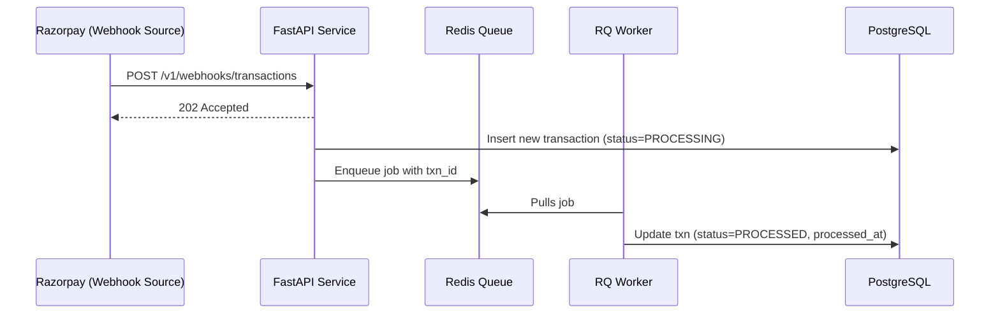

# 🚀 Payment Webhooks Processor

A robust, asynchronous Python service that receives **transaction webhooks** from external payment processors (like Razorpay), acknowledges them **immediately**, and **processes them reliably in the background**.

---

## 🧠 Overview

When external payment providers send webhook events, our API:

1. **Acknowledges instantly** with `202 Accepted` (within 500 ms).
2. **Stores the transaction** in a PostgreSQL database.
3. **Enqueues background processing** (simulating a 30 s delay to represent an external API call).
4. **Ensures idempotency** — duplicate webhooks with the same `transaction_id` are ignored.
5. **Provides endpoints** for health checks and transaction status retrieval.

---

## ⚙️ Tech Stack

| Component        | Technology                   | Purpose                         |
| ---------------- | ---------------------------- | ------------------------------- |
| Framework        | **FastAPI**                  | High-performance async REST API |
| Database         | **PostgreSQL**               | Persistent transaction storage  |
| Queue            | **Redis + RQ (Redis Queue)** | Background job processing       |
| ORM              | **SQLAlchemy**               | Database ORM                    |
| Containerization | **Docker & Docker Compose**  | Easy local setup and deployment |
| Worker           | **RQ Worker**                | Processes background jobs       |

---

## 🧩 Features

✅ **Webhook Endpoint** – Receives payment webhooks and returns immediately
✅ **Health Check Endpoint** – For uptime monitoring
✅ **Transaction Status Endpoint** – For debugging & testing
✅ **Background Processing** – Simulated 30 s delay (external call)
✅ **Idempotent Handling** – Duplicate webhooks are safely ignored
✅ **Persistent Storage** – All transactions saved in PostgreSQL
✅ **Cloud Ready** – Easily deployable to Heroku, Cloud Run, ECS, etc.

---

## 📁 Project Structure

```
payment-webhooks/
├─ app/
│  ├─ main.py              # FastAPI app & routes
│  ├─ database.py          # Database connection setup
│  ├─ models.py            # SQLAlchemy models
│  ├─ schemas.py           # Pydantic schemas
│  ├─ tasks.py             # Background job logic
│  └─ worker.py            # RQ worker helper
├─ Dockerfile
├─ docker-compose.yml
├─ requirements.txt
└─ README.md
```

---

## 🧪 API Endpoints

### 1️⃣ Health Check

**GET /**
Returns the current server time and status.

```bash
curl http://localhost:8000/
```

**Response**

```json
{
  "status": "HEALTHY",
  "current_time": "2025-10-31T10:30:00Z"
}
```

---

### 2️⃣ Receive Webhook

**POST /v1/webhooks/transactions**

```bash
curl -X POST http://localhost:8000/v1/webhooks/transactions \
  -H "Content-Type: application/json" \
  -d '{
    "transaction_id": "txn_abc123def456",
    "source_account": "acc_user_789",
    "destination_account": "acc_merchant_456",
    "amount": 1500,
    "currency": "INR"
  }' -v
```

**Response**

```
HTTP/1.1 202 Accepted
(empty body)
```

> The background worker will process this transaction in ~30 s.

---

### 3️⃣ Get Transaction Status

**GET /v1/transactions/{transaction_id}**

```bash
curl http://localhost:8000/v1/transactions/txn_abc123def456
```

**Example Response**

```json
{
  "transaction_id": "txn_abc123def456",
  "source_account": "acc_user_789",
  "destination_account": "acc_merchant_456",
  "amount": 1500.0,
  "currency": "INR",
  "status": "PROCESSED",
  "created_at": "2025-10-31T10:30:00Z",
  "processed_at": "2025-10-31T10:30:30Z"
}
```

---

## 🏗️ Local Setup (with Docker)

### 1️⃣ Prerequisites

- Docker & Docker Compose installed.

### 2️⃣ Clone and run

```bash
git clone https://github.com/<your-username>/payment-webhooks.git
cd payment-webhooks
docker-compose up --build
```

### 3️⃣ Verify services

- **FastAPI app:** [http://localhost:8000](http://localhost:8000)
- **Postgres:** localhost:5432
- **Redis:** localhost:6379

---

## 🧰 How it works (internally)

1. **FastAPI endpoint** `/v1/webhooks/transactions`:

   - Validates payload using Pydantic schema.
   - Inserts or updates the transaction in Postgres.
   - Returns `202 Accepted` immediately.
   - Enqueues the job into Redis (RQ).

2. **RQ Worker**:

   - Picks up job → waits for 30 seconds (simulated processing).
   - Updates transaction status to `PROCESSED`.

3. **Idempotency**:

   - `transaction_id` is unique in Postgres.
   - Duplicate webhook calls are ignored — only one transaction is processed.

---

## 🧠 Example flow



---

## 🧪 Testing Scenarios

| Test Case              | Expected Behavior                                 |
| ---------------------- | ------------------------------------------------- |
| **Single Transaction** | Status changes to `PROCESSED` after ~30s          |
| **Duplicate Webhooks** | Only one record in DB; no double processing       |
| **High Load**          | Webhook endpoint still responds <500 ms           |
| **Failure Handling**   | Transaction marked as `FAILED` if DB error occurs |

---

## 🚀 Deployment (Cloud)

### Option 1: **Google Cloud Run**

- Build & push image:

  ```bash
  gcloud builds submit --tag gcr.io/<project-id>/payment-webhooks
  ```

- Deploy service:

  ```bash
  gcloud run deploy payment-webhooks \
    --image gcr.io/<project-id>/payment-webhooks \
    --platform managed \
    --region asia-south1 \
    --set-env-vars DATABASE_URL=<cloudsql-url>,REDIS_URL=<memorystore-url>
  ```

- Deploy `worker` as another Cloud Run Job or container with the same env vars.

### Option 2: **Heroku**

```bash
heroku create payment-webhooks
heroku addons:create heroku-postgresql
heroku addons:create heroku-redis
git push heroku main
heroku ps:scale worker=1
```

---

## 🧩 Environment Variables

| Variable       | Description                  | Example                                   |
| -------------- | ---------------------------- | ----------------------------------------- |
| `DATABASE_URL` | PostgreSQL connection string | `postgresql://user:pass@db:5432/postgres` |
| `REDIS_URL`    | Redis connection URL         | `redis://redis:6379/0`                    |

---

## 🧱 Future Improvements

- [ ] Add webhook signature verification (HMAC)
- [ ] Add structured logging & tracing
- [ ] Add retry mechanism for failed jobs
- [ ] Add Prometheus metrics and health probes
- [ ] Replace manual DB init with Alembic migrations
- [ ] Use async SQLModel for fully async stack

---

## 🧑‍💻 Author

**Chiranjiv Rao**
Senior Python Developer
